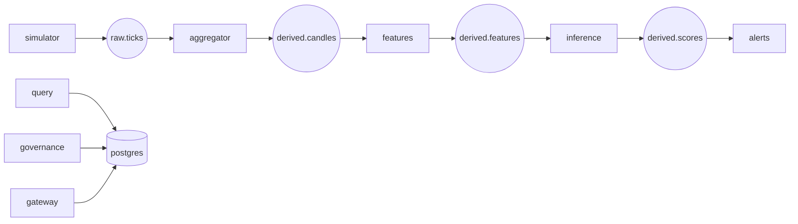

# Sentinel by Moyosore Jobi

Production-grade local streaming risk platform demo.

## What this project provides
Sentinel runs a realistic event pipeline from market ticks to derived features, model scores, and alerts, with governance and auditability built in.



## Prerequisites
### macOS / Linux
- Docker Desktop (or Docker Engine + Compose plugin)
- `make`
- Optional for host-only checks: Go 1.22+, Node 20+

### Windows
Recommended: **WSL2 + Docker Desktop integration**.
- Install Docker Desktop and enable WSL integration
- Install Ubuntu in WSL2, then install `make`
- Run all commands from WSL terminal in this repo folder

> Native PowerShell support is possible but not currently a first-class path because scripts are Bash-based.

## Step-by-step: run from your Desktop folder (`rouch-main`)
If your project is at `~/Desktop/rouch-main`, use these exact steps.

### 1) Open terminal and enter the repo
```bash
cd ~/Desktop/rouch-main
```

### 2) Verify your machine is ready
```bash
make doctor
```
Expected: warnings should be addressed before continuing (for example, missing Docker or missing dev keys).

### 3) Run quick quality checks
```bash
make lint
make test
```

### 4) Start the full demo stack
```bash
make demo
```
Use laptop-safe mode if needed:
```bash
make demo-fast
```

### 5) Preview the app/services
- Gateway: http://localhost:8080
- Dashboard: http://localhost:3000
- Query API: http://localhost:8085
- Grafana: http://localhost:3001
- Prometheus: http://localhost:9090

Credentials:
- admin@sentinel.local / Sentinel#123
- analyst@sentinel.local / Sentinel#123
- viewer@sentinel.local / Sentinel#123

### 6) Production-fit smoke checks (copy/paste)
```bash
curl -s http://localhost:8080/healthz
curl -s http://localhost:8080/readyz
curl -s http://localhost:8085/alerts | head
curl -s -u admin@sentinel.local:Sentinel#123 http://localhost:8080/audit/verify
```

### 7) Optional integration test
```bash
make integration-test
```

### 8) Stop and clean up
```bash
make down
```

## Quick start (local demo)
```bash
make doctor
make lint
make demo
```

## Standard dev workflow
```bash
make doctor
make lint
make test
make integration-test
```

## Service health + acceptance checks
After `make demo`:
- `GET /healthz` and `/readyz` returns `ok` for gateway/aggregator/features/alerts/governance/query/inference.
- Redpanda topics exist: `raw.ticks`, `derived.candles`, `derived.features`, `derived.scores`, `alerts.created`, `dq.metrics`, DLQs.
- `SELECT count(*) FROM raw_ticks` grows after simulator starts.
- `SELECT count(*) FROM candles/features/scores` grows within 1–2 minutes.
- `GET http://localhost:8085/alerts` returns rows after anomaly ticks.
- `GET http://localhost:8080/audit/verify` as admin returns `{ "ok": true }`.

## Deploying on the web / cloud
This repo is optimized for local Docker Compose demos. For hosted deployment:
1. Split compose services into separately deployable workloads (Kubernetes, ECS, Nomad, etc.).
2. Use managed Postgres and Kafka-compatible brokers.
3. Store JWT/RSA keys in a secret manager (do not keep local key files).
4. Put API services behind TLS ingress.
5. Add production observability retention and alerting policies.

## Why it's correct
- Deterministic idempotency keys persisted with UNIQUE constraints.
- Audit append-only with hash-chain verification endpoint.
- Replay runs persisted with diff summary and same storage model.

## Ports
8080 gateway, 8081 aggregator, 8082 features, 8083 alerts, 8084 governance, 8085 query, 8090 inference, 9092 redpanda, 5432 postgres.

## Troubleshooting (Top 10)
1. **Port conflicts**: run `make doctor`; stop local services using listed occupied ports.
2. **Docker startup race**: rerun `make migrate`/`make topics`; scripts wait for readiness.
3. **Missing RSA keys**: run `make dev-keys`.
4. **Missing topics**: run `make topics`.
5. **Migration failure**: run `make down && make demo` to reset state.
6. **No alerts generated**: wait for anomaly phase or use `make demo-fast`.
7. **Web not loading**: first run may spend time in `npm install`; check `docker compose logs web`.
8. **Audit verify fails**: check for manual mutations; `audit_log` update/delete is blocked by trigger.
9. **Integration tests skipped/fail**: ensure Docker daemon is available with enough memory/CPU.
10. **Dependency network restrictions**: full-host `go test ./...` may fail in restricted networks; use Docker-based paths for full integration runs.

## Presentation Summary

Sentinel is a production-style streaming risk platform that ingests market ticks, computes derived features, performs real-time inference, and drives governed alert workflows with RBAC and append-only audit verification.

Phase 2 hardening focused on deterministic startup gates, truthful readiness, deeper multi-language test coverage, and deployment/runbook artifacts suitable for architecture review and due diligence.
