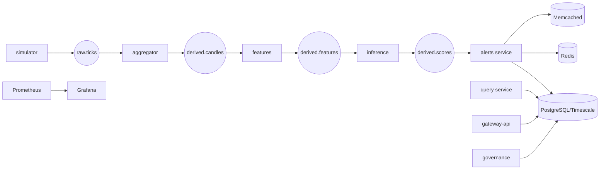

# Sentinel

Sentinel is a streaming risk alerts platform for market surveillance and risk operations. It ingests tick-like events, computes features, scores anomalies, creates alerts, and lets authenticated users triage or govern incident workflows with RBAC and auditability.

## What Sentinel does end-to-end
- Ingests market-style events through Kafka/Redpanda topics.
- Builds derived feature streams and anomaly scores.
- Creates alerts and exposes alert lifecycle actions (`open` -> `ack`).
- Enforces role-aware access for viewer, analyst, and admin.
- Records append-only audit events and provides audit hash-chain verification.
- Supports deterministic replay run creation for incident review workflows.
- Exposes Prometheus/Grafana observability endpoints locally.



## Role map and capabilities
### Viewer (monitoring only)
- Overview and Scores tabs.
- Read-only risk watchlist and live feed snapshots.
- Cannot acknowledge alerts, replay, deploy models, or verify audits.

### Analyst (triage)
- Overview, Alerts, and Scores tabs.
- Can acknowledge open alerts.
- Can trigger replay through governance API contract (when surfaced by UI/endpoint).
- Cannot deploy models or verify audit chain.

### Admin (governance + control plane)
- All tabs including Governance.
- Can acknowledge alerts, start replay, deploy models, and verify audit chain.
- Can inspect model registry and governance state.

## Architecture and service responsibilities
- `simulator` (Go): emits synthetic ticks to Kafka/Redpanda.
- `aggregator` (Go): builds candle-like aggregates and persists pipeline data.
- `features` (Go): computes derived feature payloads.
- `inference` (Python): loads model logic and emits anomaly scores.
- `alerts` (Go): consumes scores, writes alerts, serves SSE stream and ack endpoint.
- `query` (Go): read APIs for alerts and scores.
- `gateway-api` (Go): auth, `/me`, and audit verification endpoint.
- `governance` (Go): model deploy, replay start, model registry read APIs.
- `web` (Next.js): role-aware operator console.

## API surface (current)
- Gateway: `POST /auth/login`, `POST /auth/logout`, `GET /me`, `GET /audit/verify` (admin).
- Query: `GET /alerts`, `GET /scores`.
- Alerts: `GET /sse/alerts`, `POST /alerts/{id}/ack`.
- Governance: `GET /models`, `POST /models/deploy`, `POST /replay/start`.

## Local run guide (Docker Compose + Make)
### Prerequisites
- Docker Desktop (or Docker Engine + Compose plugin)
- `make`
- Optional host checks: Go 1.22+, Node 20+

### 1) Prepare environment
```bash
make doctor
make dev-keys
```

### 2) Start the full stack
```bash
make demo
```
For a lighter run:
```bash
make demo-fast
```

### 3) Access URLs
- Web: http://localhost:3000
- Gateway API: http://localhost:8080
- Alerts SSE: http://localhost:8083/sse/alerts
- Query API: http://localhost:8085
- Governance API: http://localhost:8084
- Grafana: http://localhost:3001
- Prometheus: http://localhost:9090

### 4) Seeded credentials
- `admin@sentinel.local` / `Sentinel#123`
- `analyst@sentinel.local` / `Sentinel#123`
- `viewer@sentinel.local` / `Sentinel#123`

### 5) Stop/reset
```bash
make down
```

## Testing
### Backend/unit
```bash
make test
```

### Frontend/unit
```bash
cd web && npm test
```

### Integration
```bash
make integration-test
make integration-suite
```

### Suggested smoke checks
```bash
curl -s http://localhost:8080/healthz
curl -s http://localhost:8080/readyz
curl -s http://localhost:8085/alerts | head
curl -s -u admin@sentinel.local:Sentinel#123 http://localhost:8080/audit/verify
```

## Observability and infra notes
- Prometheus scrapes service health/metrics targets.
- Grafana ships with a Sentinel dashboard JSON in `grafana/`.
- Redis and Memcached are available for metadata/read-latency optimization patterns used by the stack.
- PostgreSQL is the system of record; migration scripts live in `sql/migrations/`.
- Kafka-compatible Redpanda backs streaming topic flow.

## AWS/Kubernetes positioning
- Local runtime is Docker Compose first.
- Kubernetes manifests exist under `deploy/k8s/` as deployment readiness artifacts.
- AWS integration points are represented as extension/deployment pathways, not full local managed-AWS runtime.

## Production-minded strengths surfaced in this repository
- Idempotency-aware stream handling patterns.
- Durable persistence before lifecycle progression.
- RBAC checks on sensitive actions.
- Append-only audit chain with verification endpoint.
- Replay workflow endpoint for incident review.
- Multi-service, multi-language topology with integration checks.

## Troubleshooting quick list
1. Port conflicts: run `make doctor`.
2. Missing JWT keys: run `make dev-keys`.
3. Missing topics after reset: run `make topics`.
4. Migration failures: run `make down`, then `make demo`.
5. No alerts yet: wait for simulator/anomaly phase or use fast mode.
6. Web startup delay: first run may install Node dependencies in container.
